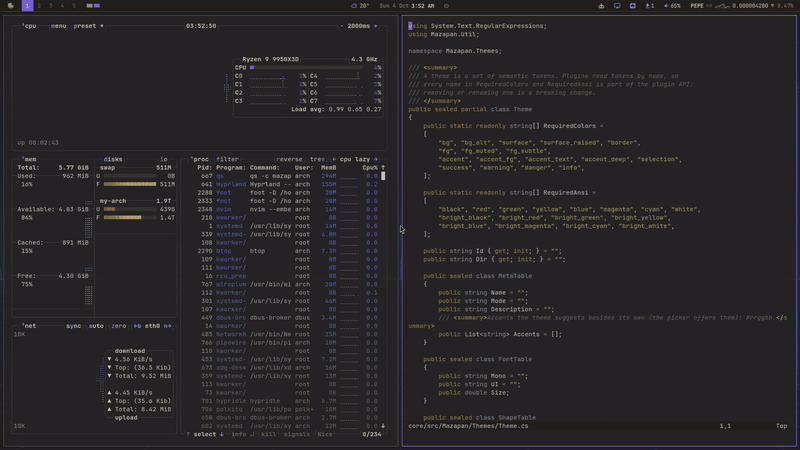
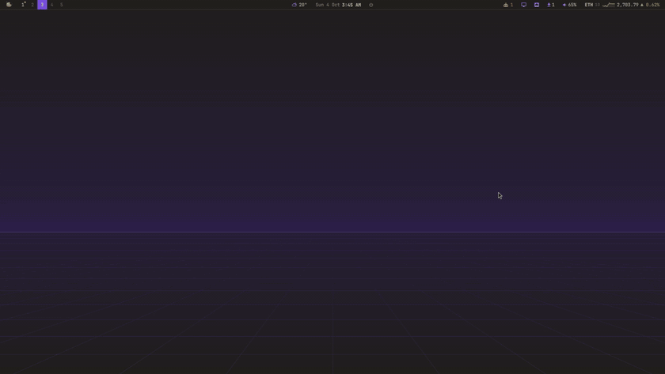
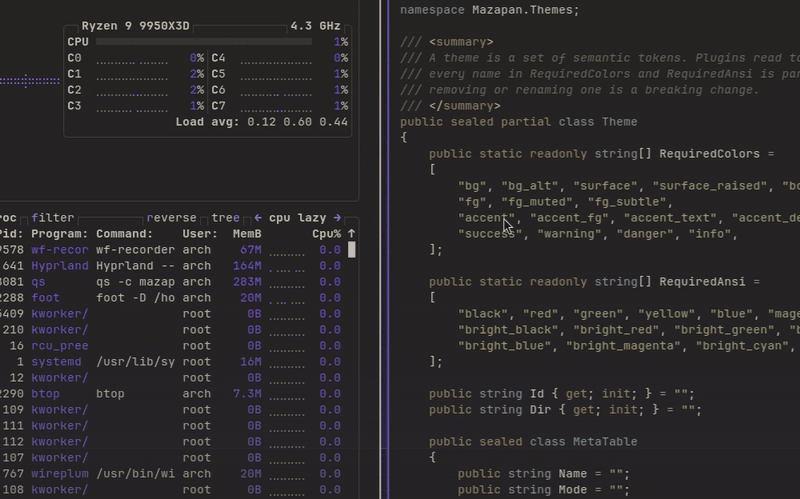
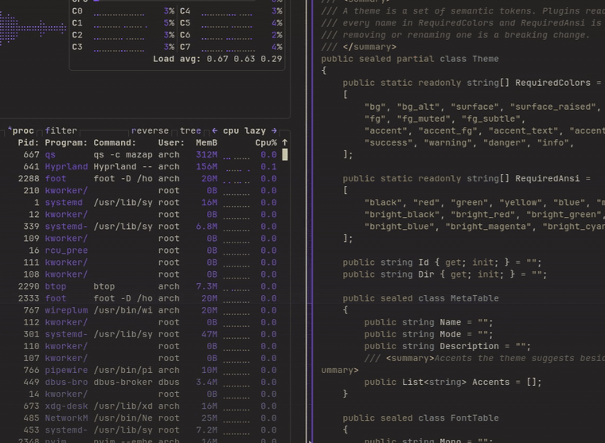
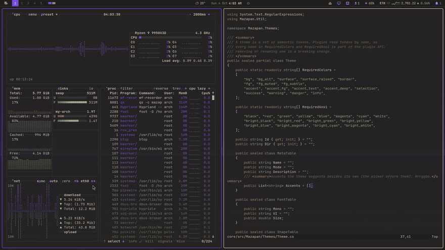
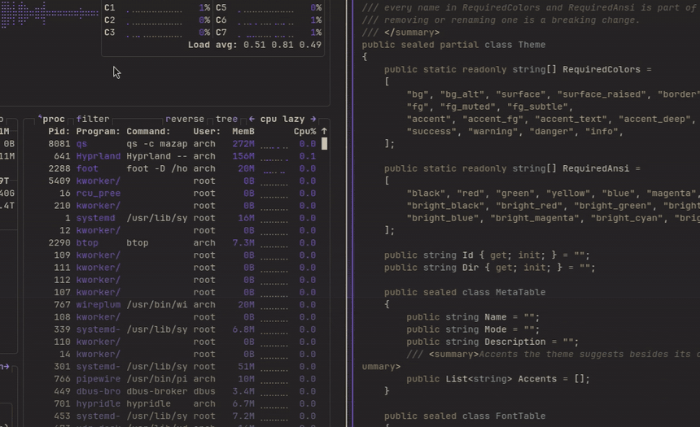
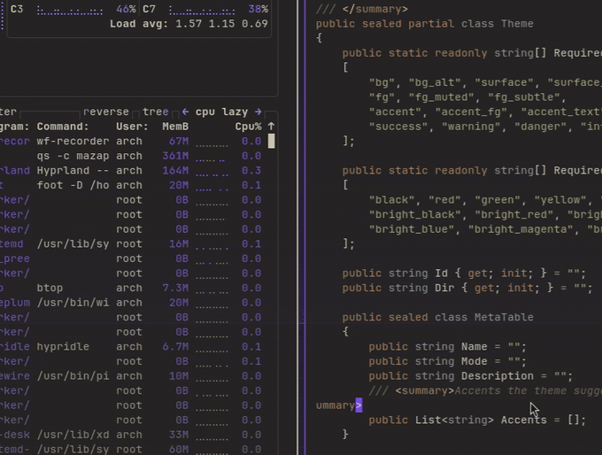
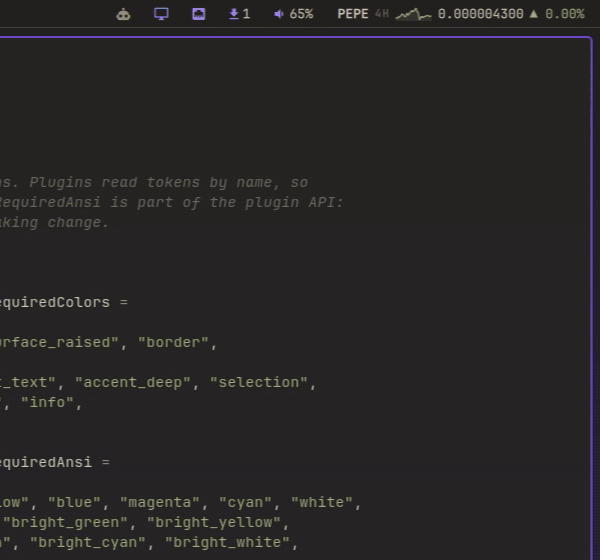
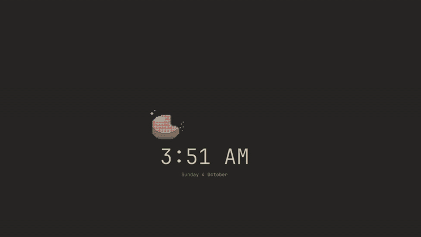

<h1 align="center">
  <br>
  Mazapan
</h1>

<p align="center"><b>An agentic desktop OS on Arch Linux.</b></p>

<p align="center">
  Your coding agents are part of the desktop: live in the bar, their limits
  and spend in one place, and able to change the system only through
  previewed, undoable steps that you approve. Hyprland and Quickshell, one
  theme across the whole OS, checkpoints you can boot into.
</p>

<p align="center">
  
  
  
  
  
  
  
  <a href="https://github.com/rick-dev-creator/mazapan/actions/workflows/ci.yml"></a>
</p>

<p align="center">
  <a href="#why-i-made-mazapan">Why</a> ·
  <a href="#at-a-glance">At a glance</a> ·
  <a href="#agentic-os">Agentic OS</a> ·
  <a href="#made-for-developers">Developers</a> ·
  <a href="#a-tour">Tour</a> ·
  <a href="#plugins-and-extensibility">Plugins</a> ·
  <a href="#every-feature">Every feature</a> ·
  <a href="#install">Install</a> ·
  <a href="#contributing">Contributing</a> ·
  <a href="docs/roadmap.md">Roadmap</a>
</p>

<p align="center"></p>

<p align="center"><sub>Claude Code asks, through Mazapan's MCP server, to switch the theme. The card shows exactly what it would write; one click, and the whole desktop follows, the agents' dashboard included. <i>(Sample accounts and data.)</i></sub></p>

> **A personal project, shared as it is.** Mazapan is one person's desktop,
> made public in case it helps someone else. It comes with no warranty of
> any kind (see [LICENSE](LICENSE)): installing it erases the disk you pick,
> so back up what matters first, and read [docs/first-install.md](docs/first-install.md)
> and [docs/security.md](docs/security.md) before trying it on a real machine.

## Why I made Mazapan

I've been writing software for two decades, always on Windows. I still like
Windows, but Linux's versatility, and how far you can make it your own,
won me over.

So I changed Linux little by little until it became something I think is
worth sharing: a desktop for developers who want Linux without having to
live in the terminal to keep it running. Everything has a panel, and every
panel shows the command it runs, so you learn as you go instead of before
you start.

I'm a .NET developer, and I wanted to show that .NET belongs on Linux too:
the core of Mazapan is C#, compiled ahead of time into one native binary,
and ASP.NET Core, Aspire, Rider and VS Code are ready to use from the first
start.

I work with several coding agents and several subscriptions, and the tools
around them fell short: which one is waiting for me, how close each account
is to its limit, what all of it costs. So Mazapan grew around agents: it
sees them, counts for them, and lets them work on the system safely.

And we're all different: gamers, developers, designers, people who just
want a browser and an office suite. So the first start asks what you'll use
the computer for, and installs the apps for it, my .NET stack included.

If it's useful to you too, that's the best that could happen to it.

— rickdev

## At a glance

| | |
|---|---|
| 🤖 **Agentic OS** | Every agent's live sessions in the bar · each account's limits · a dashboard of cost and tokens · a built-in MCP server · an approval card with the exact diff · ask from anywhere · diagnosis from crashes, checks and checkpoints |
| 💿 **Install** | Graphical and text installers in 5 languages · full-disk encryption · a recovery key as text and QR · hardware fixes picked for your machine |
| 🛟 **Updates and safety** | Arch news before updating · automatic rollback when a check fails · checkpoints you boot into from the menu · a signed repository · a firewall that denies everything in |
| 🪟 **Desktop** | Niri-style scrolling columns · overview of every workspace · command palette · settings · monitors with profiles · notifications and Do Not Disturb · night light · modes · idle and hibernate |
| 🎨 **Look** | One theme for the whole OS (16 targets, GRUB to VS Code) · a live theme picker · a theme from any picture · 7 screensavers |
| 🧰 **Everyday tools** | Capture with OCR, annotations, QR and recording · clipboard history · emoji and color pickers · offline dictation · reminders · web apps · LocalSend and Taildrop |
| 👩‍💻 **Developers** | Profiles for Development, .NET, Mobile (Expo) · containers without root · one-click databases · every language's versions with mise |
| 🎮 **Gaming** | Steam, Heroic, Lutris, gamescope, GameMode, MangoHud · games on the discrete GPU · emulators for 20+ systems |
| 🧩 **Extensible** | 100 plugins, the bar and the installer included · a Plugins panel · write your own in minutes · every change previewed and undoable |

## Agentic OS

Most desktops treat a coding agent as one more terminal. Mazapan treats
agents as users of the system with their own place in it: it sees them, it
counts what they spend, it answers their questions about the machine, and
it lets them change things the way a person does, never behind your back.

<table>
  <tr>
    <td width="50%"><p align="center"><b>Every change approved</b>, with its exact diff</p></td>
    <td width="50%"><p align="center"><b>Dashboard</b>: cost, tokens, models, projects, limits</p></td>
  </tr>
  <tr>
    <td align="center"><p align="center"><b>Live sessions</b> and each account's limits, in the bar</p></td>
    <td><p align="center"><b>Ask</b> from anywhere, answered in a card</p></td>
  </tr>
</table>
<p align="center"><sub>Sample accounts and data; the answer shown is a sample too.</sub></p>

### Sees your agents
- **Live sessions in the bar** for Claude Code, Codex, opencode and pi: which
  one is working, which **waits for you** (with a notification), which is
  done; a click goes to its window.
- **Every account found by itself**, each Claude account's **limits** (the
  5-hour and weekly windows) and when they reset; `mazapan agents run claude`
  starts it with the first account that still has room.
- A **dashboard**: tokens and cost by day, agent, account, model and project,
  at API prices; what the providers actually billed (keys kept in the
  keyring); lines, commits and pull requests through OpenTelemetry; when you
  work, by weekday and hour. Numbers only, read locally: never a prompt.

### Lets them act, safely
- **A built-in MCP server**, `mazapan mcp`: agents read the whole state
  (themes, plugins, health checks, history, checkpoints, their own usage)
  and change the desktop through `preview_change`, `apply_change` and `undo`.
  ```sh
  claude mcp add --scope user mazapan -- mazapan mcp
  ```
- **The approval card**: an agent's change waits for you, showing who asks
  and the exact diff of every file. Allow, Don't allow, or Always allow
  that agent. Each change is marked with the agent in History, and undoable.
- **Guardrails by design**: agents set numbers and switches, never text
  that could become a command; nothing as root; no plugin installs or
  system updates. Those stay yours, and the agent is told the command to
  give you instead.

### Answers about your machine
- **Ask from anywhere**: `?` in the palette, about a screenshot, the
  selected text, files (right click in Files), or **by voice**. The answer
  comes in a card; "Continue in a terminal" picks the conversation up.
  Asked read-only, in an empty folder, with no keys.
- **Diagnosis built in**: an app crashes, a health check fails, or a
  checkpoint was needed, and "Ask an agent" hands over `mazapan report`
  (state, failing checks, recent errors, what changed since the
  checkpoint), framed as data, not instructions.
- **Recent projects** in the palette reopen the editor and the agent's last
  conversation together.

Full reference: [docs/agent-api.md](docs/agent-api.md).

## Made for developers

Whatever you build, the first start sets it up: pick the profiles that fit
you, and each installs its apps and wires them together, saying first what
it will do, undoable.

- **Development**: VS Code, Zed, Neovim, Git, GitHub CLI, lazygit, the
  command-line tools you reach for (ripgrep, fd, fzf, bat, eza, zoxide, jq),
  and **mise** for every language's versions per project (Node, Python,
  Ruby, Go…).
- **Containers without root**: Podman with `docker` commands working, found
  by Testcontainers, devcontainers and Compose; Docker too if you prefer it.
- **Databases one click away**: PostgreSQL, MySQL, SQL Server, Redis and
  MongoDB in local containers, their data kept, the connection string
  copied as a URL or in your framework's format.
- **.NET**: the SDK with ASP.NET Core's HTTPS certificate trusted (by .NET,
  Chromium and Firefox), **Aspire** and its templates on Podman, Rider and
  VS Code from their makers, checked against their SHA-256.
- **Mobile (Expo)**: Node.js, Java 17, Android Studio with its SDK and
  emulators found, phones over USB, a new app one action away.
- **Your agents**, whatever you code with: see [Agentic OS](#agentic-os).
- **And for everyone else**: Basic, Gaming, Retro, Creative, Office,
  Streaming, Trading. Profiles can be mixed, and changed any time
  (`SUPER + ALT + A`).

## A tour

### One theme, everywhere, previewed live

<p align="center"></p>

`SUPER + SHIFT + T`: move through the themes and the whole desktop follows
as you go (bar, terminals, editors, apps); `tab` picks an accent, `↵`
applies it. A theme can also be made from any picture, its contrast checked.

### Tiling, borrowed from Niri

<p align="center"></p>

Hyprland underneath, Niri's ideas on top (the `columns` and
`bar-workspaces` plugins):

- **A strip that scrolls**: each window opens as a new column to the right,
  at its own width; the others never resize. The view follows the focus.
- **Widths that cycle** (`SUPER + R`: a third, a half, two thirds, all of it), grow and
  shrink (`SUPER + ALT + ← →`), **maximize the column** (`SUPER + F`), and
  **stack two windows in one column** or take one out (`SUPER + [ ]`).
- **Columns that move** (`SUPER + SHIFT + ← →`), workspaces one after
  another (`SUPER + Page Up/Down`), touchpad **gestures** to scroll the strip
  and change workspace.
- **An overview** of every workspace at once (`SUPER + Tab`), live previews
  on hover in the bar whose windows you drag out, and a mini map of the
  strip in the bar.
- Or the classic layouts: equal widths, a phone-width column, a focus layout.

### Everything from one palette, and apps by what you do

<table>
  <tr>
    <td width="50%"></td>
    <td width="50%"></td>
  </tr>
  <tr>
    <td valign="top"><b>Command palette</b> (<code>SUPER + Space</code>): apps, windows and every plugin's actions, each showing the command it runs, so you learn the terminal as you go. <code>&gt;</code> for actions only.</td>
    <td valign="top"><b>Apps</b> (<code>SUPER + ALT + A</code>): profiles for what you'll do, every app one by one, search, and what's installed. Each says what it will do first, and is undoable.</td>
  </tr>
</table>

### Capture, read, annotate

<p align="center"></p>

`Print` freezes the screen: click a window or drag a region, then copy,
save, copy its **text** (OCR), read a **QR** code, **annotate** it, share it,
ask an agent about it, or **record** it.

### A plugin ecosystem

<p align="center"></p>

`SUPER + SHIFT + P`, like an editor's extensions view: every plugin with its
page, **what it can do** (every file it writes and command it runs) and its
**settings** as controls. More in [Plugins and extensibility](#plugins-and-extensibility).

### A first start that asks, and notifications that don't nag

<table>
  <tr>
    <td width="50%"></td>
    <td width="50%"></td>
  </tr>
  <tr>
    <td valign="top"><b>Welcome</b>: language, keyboard, time zone, Wi-Fi, the look, and what you'll use the computer for, which installs its apps. Again any time from the palette.</td>
    <td valign="top"><b>Notifications</b> in the theme, with their actions; a quiet center by app (<code>SUPER + N</code>), Do Not Disturb (<code>SUPER + SHIFT + N</code>), by schedule or in full screen.</td>
  </tr>
</table>

### Screensavers of its own

<p align="center"></p>

The bitten mazapan, an 80s terminal, code rain, stars, the Game of Life,
pipes and glow, in the theme's colors; or one at random. A video or a call
keeps them away.

### And more

<table>
  <tr>
    <td width="50%"><p align="center">The desktop, in Phosphor</p></td>
    <td width="50%"><p align="center"><b>Overview</b> of every workspace</p></td>
  </tr>
  <tr>
    <td><p align="center">Booted into a <b>checkpoint</b>: keep it, or ask what broke</p></td>
    <td><p align="center">The <b>installer</b>'s recovery key</p></td>
  </tr>
  <tr>
    <td><p align="center"><b>Monitors</b>, with live thumbnails and profiles</p></td>
    <td><p align="center"><b>Settings</b></p></td>
  </tr>
  <tr>
    <td><p align="center"><b>Retro</b>: a homebrew NES game in RetroArch</p></td>
    <td><p align="center">Each theme drawn as a small desktop</p></td>
  </tr>
</table>

## Plugins and extensibility

**Everything is a plugin**, the bar and the installer included, and yours
use the same API as the built-in ones: a `plugin.toml` (what it needs, its
settings, actions, keybindings, health checks, translations) and templates
for the files it writes, in any format (Lua for Hyprland, QML for the shell,
TOML, JSON, CSS, shell…), filled from the theme and your settings.

- **The Plugins panel** (`SUPER + SHIFT + P`), like an editor's extensions
  view: built-in, yours and the catalogs', each with its README, what it
  can do and its settings as controls, in your language.
- **Write one in minutes**: `mazapan plugins new my-widget --kind bar`, then
  `plugins dev` (applied again on every save) and `plugins check`; `plugins
  fork` copies a built-in one to change it.
- **Installed with consent**: `mazapan plugins add <git-url>` shows what a
  plugin will be able to do (files, commands, root, packages) before
  anything runs; `plugins.lock` brings the same set to another machine.
- **Safe to experiment**: Mazapan never overwrites a file it didn't write
  or one you edited; every apply is previewed (`--dry-run --diff`) and
  undoable (`mazapan undo`, or History).
- **Health checks** of every plugin after each update (`mazapan doctor`);
  one that fails rolls the update back.

<details>
<summary><b>All 100 built-in plugins</b>, by what they're for</summary>

**Agents**

- **Agents** (`agent`): Your coding agents: in the bar, which is working and which waits for you (a click goes to its window), each account's limits and when they reset,…

**Shell and bar**

- **Bar** (`shell-bar`): A bar on every monitor (Quickshell), filled with the widgets other plugins put in its left/center/right slots
- **Workspaces** (`bar-workspaces`): Workspace numbers in the bar, with a live preview on hover whose windows can be dragged out, and an overview of every workspace at once (as Niri's)
- **Window title** (`bar-window-title`): The focused window's title in the bar, next to the workspaces
- **Clock** (`bar-clock`): Day, date and time in the middle of the bar, in the system's language
- **Weather** (`bar-weather`): Current weather in the middle of the bar: click for details and the forecast
- **Battery** (`bar-battery`): The battery in the bar (only where there is one)
- **Network** (`bar-network`): Network state in the bar: click for Wi-Fi (scan, join, forget) and wired connections
- **Bluetooth** (`bar-bluetooth`): Bluetooth in the bar: click to connect, pair and forget devices
- **Volume** (`bar-volume`): Output volume in the bar: scroll to change, middle-click to mute, click for outputs and inputs
- **Notifications** (`notifications`): Every app's notifications, in the theme: banners that stop under the pointer, with their actions and replies
- **Media keys** (`osd`): The volume, microphone, brightness and media keys, and what they did shown for a moment on screen
- **Privacy dots** (`privacy`): Dots in the bar while the microphone, the camera or the screen is in use, as macOS shows them
- **Power** (`power`): Lock, suspend, log out, reboot and shut down: a button in the bar, the palette, and a lock screen in the theme
- **Password prompts** (`polkit`): The polkit agent: when an app needs rights it doesn't have (mount a disk, change the time), it asks for your password here, in the theme

**Finding and changing things**

- **Command palette** (`palette`): One palette for apps, open windows, every plugin's actions and keybindings, each showing the command it runs
- **Settings** (`settings`): The settings everyone needs, a page each: keyboard, touchpad and mouse, default apps, language and time zone, the screens and the look
- **History** (`history`): What changed on the desktop, in words (a theme, a setting, a plugin on or off, an update), newest first, each with its own undo
- **Welcome** (`welcome`): The first login's welcome: language, keyboard, time zone, Wi-Fi, the look and apps by profile, a screen each
- **Plugins** (`plugin-manager`): Find, install and set up plugins: the built-in ones, yours and the catalogs', each with its page (README, what it can do, settings)
- **Login screen** (`login`): The login screen in the theme: the clock, your name, your password (greetd, with a Hyprland of its own and a Quickshell greeter)

**Windows, workspaces and screens**

- **Hyprland base** (`hypr-base`): Hyprland entry point: monitors, input, core bindings
- **Columns** (`columns`): Windows as columns on a strip that scrolls, as Niri does
- **Window titles** (`window-titles`): One key shows or hides a title bar on every window
- **Monitors** (`monitors`): Monitor profiles matched by EDID, applied on their own when screens come and go
- **External screens' brightness** (`ddc-brightness`): The brightness keys (and the palette's Brighter and Dimmer) change external screens too, over the cable (DDC/CI), as the laptop's own

**Look**

- **Theme picker** (`themes`): Pick a theme and an accent, previewed live on the desktop, with each theme's contrast checked
- **Wallpaper** (`wallpaper`): The wallpaper: drawn from the theme, the theme's picture, or yours (per screen, filled, tinted with the theme, in turn, day and night), with a…
- **Screensaver** (`screensaver`): After a while without use, every screen shows the time over one of seven scenes in the theme's colors (the mazapán bouncing about, an 80s…
- **Night light** (`night-light`): The screens warmer at night, fading in and out slowly
- **Hyprland theme** (`theme-hyprland`): Borders, gaps, rounding, background and animations from the theme
- **Quickshell theme** (`theme-quickshell`): Theme tokens as a QML singleton (Theme.qml) for every shell widget
- **GTK theme** (`theme-gtk`): GTK4/libadwaita and GTK3 (via adw-gtk3) colors, fonts and dark mode
- **Qt theme** (`theme-qt`): Qt 6 apps (KDE's too) in the theme: palette, font and style through qt6ct, and KDE's color scheme
- **foot theme** (`theme-foot`): foot terminal: font, palette, opacity and a blinking block cursor in the accent color
- **kitty theme** (`theme-kitty`): kitty terminal in the theme: font, palette, opacity, tabs and borders
- **Alacritty theme** (`theme-alacritty`): Alacritty terminal in the theme: font, palette, opacity
- **Ghostty theme** (`theme-ghostty`): Ghostty terminal in the theme: font, palette, opacity
- **btop theme** (`theme-btop`): btop in the theme: its boxes, graphs and meters from the theme's colors, over the terminal's background
- **Neovim theme** (`theme-neovim`): A Neovim colorscheme from the theme (syntax, Treesitter, LSP, diagnostics, git, Telescope), used when you haven't chosen another
- **VS Code theme** (`theme-vscode`): VS Code, Code - OSS and VSCodium in the theme
- **Obsidian theme** (`theme-obsidian`): Obsidian in the theme, in every vault: its colors, accent, fonts and corners as a theme of its own (Mazapan), picked once in its settings and…
- **Firefox theme** (`theme-firefox`): Firefox and its forks (Zen, LibreWolf, Floorp, Waterfox) in the theme, in every profile
- **Chromium theme** (`theme-chromium`): Chromium, Chrome, Brave and Edge follow the theme through GTK (theme-gtk), in every profile
- **Boot screen in the theme** (`theme-plymouth`): The screen while the computer starts, and the disk's password asked there, in the theme's colors and your language (Plymouth)
- **Boot menu in the theme** (`theme-grub`): GRUB's menu (and the snapshots in it) in the theme's colors

**Everyday tools**

- **Capture** (`capture`): One capture overlay: pick a region or a window on a frozen screen, then copy, save, copy its text (OCR), annotate or record it
- **Clipboard history** (`clipboard`): What you copied, text and pictures, kept and searchable
- **Color picker** (`color-picker`): Pick any color on screen: it's copied, and a notification says which
- **Emoji picker** (`emoji`): Every emoji, by category and found by name in your language
- **Dictation** (`dictation`): Speak instead of typing: a key starts listening, the same key stops, and what you said is typed where you are
- **Reminders** (`reminders`): A bell in the bar: what to remember and when (in ten minutes, at five, tomorrow morning), said as a notification then
- **Share** (`share`): Files, a picture or text from the clipboard to a device nearby (LocalSend) or one of your devices on your tailnet (Taildrop), from the palette or…
- **Web apps** (`webapps`): A site as an app of its own (WhatsApp, Gmail…)
- **Default apps** (`default-apps`): What opens links, PDFs, pictures, videos, music, text, folders, mail, documents and archives
- **Input method** (`input-method`): Typing Chinese, Japanese and Korean (fcitx5, with Pinyin, Mozc and Hangul), in every app
- **Modes** (`modes`): The whole desktop changed at once: quiet but for some apps, the theme, night light, the power profile, keep awake, what the bar shows
- **Idle** (`idle`): After a while without use: the screens dim, then lock, turn off, and the computer suspends (sooner on battery)
- **Hibernation** (`hibernate`): Nothing lost when the battery dies: the lid's sleep turns into hibernation after a while, and a battery about to die hibernates instead of cutting out
- **Crash watcher** (`crash-watch`): When an app closes unexpectedly (the desktop itself included), a notification says which, with "Ask an agent": the agent gets the report, the…

**Apps and development**

- **Apps** (`apps`): Install apps by what you'll use the computer for (Development, Gaming, Creative…) or one by one, with one button
- **.NET, set up** (`dev-dotnet`): ASP.NET Core and Aspire ready to use: the HTTPS development certificate trusted (by .NET, and by Chromium and Firefox), Aspire's templates…
- **Expo, set up** (`dev-expo`): Expo apps on Android from the first try: Android's SDK and emulator found (ANDROID_HOME, adb and the emulator on the PATH), Java 17 for Gradle,…
- **Databases for development** (`dev-databases`): PostgreSQL, MySQL, Redis, SQL Server and MongoDB one click away, in containers on this computer alone, their data kept
- **Podman** (`podman`): Containers ready to use without root or a service
- **Docker** (`docker`): Docker itself, ready: its service started with the first command, you in the docker group so it needs no sudo (as powerful as root
- **Tailscale** (`tailscale`): Tailscale ready to use: its service started, you its operator (no sudo to sign in or send files), signing in from the palette, and files sent to…

**Gaming**

- **Gaming** (`gaming`): Games at their best: on the NVIDIA card on hybrid laptops, the 32-bit drivers Windows games need, drawn with the least delay, and the screen never…
- **Emulation** (`emulation`): Retro and console games, ready: ~/Games with a folder per console for your games and one for BIOS, RetroArch set up on them the first time, and…

**System, updates and safety**

- **Updates** (`updates`): Updates you see: the bar says when there are (the whole system's and the Flatpak apps'), a panel shows what changes, the news to read first and…
- **Updates downloaded ahead** (`update-ahead`): The updates there are, downloaded in the background while plugged in and on a connection that isn't metered, so updating takes moments
- **Checkpoints** (`hw-checkpoints`): The system as it was before every change, in the boot menu (encrypted disks too)
- **System snapshots** (`hw-snapshots`): A btrfs snapshot of the system before and after every package change (an update, an install), the last ones kept
- **Firewall** (`firewall`): A firewall, as macOS has one switch for: nothing comes in that this computer didn't ask for, everything it asks for goes out (ufw)
- **Installer** (`installer`): The ISO's installer: this system onto a disk in a few screens (language, keyboard, where you are, the disk, your account, what you'll use it for),…

**Hardware fixes (on the machines that need them)**

- **Wi-Fi passwords on Macs with Broadcom Wi-Fi** (`hw-apple-brcmfmac-wpa`): Macs whose Broadcom Wi-Fi runs on the brcmfmac driver (2015 on, T2 Macs too) join WPA2/WPA3 networks that otherwise turn the right password down
- **Function keys first on Apple keyboards** (`hw-apple-fnkeys`): F1–F12 as function keys, media keys with Fn, on keyboards the hid_apple driver runs
- **MacBook NVMe waking from sleep** (`hw-apple-nvme-suspend`): Keeps the NVMe drive of the 2015-2017 MacBook and MacBook Pro out of its deepest power state (D3cold), which it fails to wake from after sleep
- **MacBook SPI keyboard at boot** (`hw-apple-spi-keyboard`): The built-in keyboard and touchpad of the 2015-2017 MacBook and MacBook Pro (on SPI) working from the start of boot, so the disk password can be typed
- **ASUS ExpertBook B9406 screen that keeps updating** (`hw-asus-b9406-panel-replay`): The ASUS ExpertBook B9406 (Intel Panther Lake) screen no longer freezes on its last frame
- **ASUS Panther Lake screen brightness** (`hw-asus-ptl-backlight`): Screen brightness that really changes on the ASUS ExpertBook B9406 and Zenbook UX5406AA (Intel Panther Lake), not only full or off
- **ASUS ROG laptop controls** (`hw-asus-rog`): asusctl on ASUS ROG laptops: performance profiles, fan curves, a battery charge limit and the keyboard's lighting
- **ASUS ROG laptop speaker volume** (`hw-asus-rog-audio`): Volume on ASUS ROG laptops set in software (WirePlumber's soft mixer), away from the Realtek codec's hardware mixer quirks that muffle the speakers
- **ASUS ROG Flow Z13 touchpad while typing** (`hw-asus-z13-touchpad`): The touchpad of the ASUS ROG Flow Z13's (GZ302) detachable keyboard ignored while typing, as a built-in one is
- **Broadcom BCM4360 and BCM4331 Wi-Fi** (`hw-broadcom-wl`): Broadcom's wl driver for the BCM4360 and BCM4331 Wi-Fi chips (2012-2015 MacBooks, and other laptops), which the kernel's own drivers run poorly or…
- **Fingerprint reader** (`hw-fingerprint`): A finger unlocks the screen and allows system changes (the password still works)
- **Framework Laptop 13 (AMD) microphones** (`hw-framework13-amd-mic`): The built-in microphones of the Framework Laptop 13 with AMD Ryzen working
- **Framework Laptop 16 keyboard lighting** (`hw-framework16-keyboard`): Lets you, not only root, talk to the Framework Laptop 16's keyboard, to set its RGB lighting and keys (qmk_hid, or the VIA configurator in a browser)
- **Intel low power mode** (`hw-intel-lpmd`): Intel's Low Power Mode Daemon on laptops with a hybrid Intel processor (Alder Lake, Raptor Lake, Meteor Lake, Lunar Lake, Panther Lake)
- **Video decoding on Intel graphics** (`hw-intel-video`): Hardware video decoding (VA-API) on Intel graphics
- **Wi-Fi 6 on Intel BE200 and BE211 cards** (`hw-intel-wifi7-eht`): Turns Wi-Fi 7 off on Intel BE200 and BE211 cards (Dell XPS 14 and 16 on Panther Lake, and others)
- **Cursor with several GPUs** (`hw-multi-gpu-cursor`): Draws the cursor in software when the machine has several GPUs (one renders, another drives screens
- **Cursor on the nouveau driver** (`hw-nouveau-cursor`): Draws the cursor in software where an NVIDIA GPU runs the open nouveau driver
- **NVIDIA (Turing and newer)** (`hw-nvidia`): NVIDIA's open driver for GeForce RTX 20 and newer
- **Surface keyboard at boot** (`hw-surface-keyboard`): The built-in keyboard of Microsoft Surface laptops working from the start of boot, so the disk password can be typed
- **Surface Wi-Fi firmware** (`hw-surface-wifi`): The firmware for the Marvell Wi-Fi and Bluetooth in Microsoft Surface devices (linux-firmware-marvell), which Arch's linux-firmware doesn't bring…
- **Synaptics touchpads over SMBus** (`hw-synaptics-intertouch`): Synaptics touchpads through InterTouch (SMBus) instead of PS/2: smooth scrolling and gestures on ThinkPads and other laptops
- **Vulkan on Intel graphics** (`hw-vulkan-intel`): Vulkan on Intel graphics (Mesa's driver): games, Steam and Proton, and apps that draw with Vulkan, on the GPU instead of failing or falling back…
- **Vulkan on AMD graphics** (`hw-vulkan-radeon`): Vulkan on AMD Radeon graphics (Mesa's RADV driver)
- **Lenovo Yoga Pro 7 bass speakers** (`hw-yoga-pro7-bass`): Turns on the bass speakers of the Lenovo Yoga Pro 7 (14IAH10), silent without the right codec pin model

Each with its full description: [docs/plugins.md](docs/plugins.md).

</details>

How to write one: [docs/plugin-api.md](docs/plugin-api.md).

## Every feature

Arch owns the critical parts (kernel, packages, updates); Mazapan is the
layer on top, written as 100 plugins over one small core, `mazapan`, a single
native binary. Every change it makes, yours or an agent's, is previewed,
written only where it may, and undoable.

### Install and security
- A **graphical installer** from a live desktop (and a text one for when
  graphics fail), in English, Spanish, Portuguese, French and German.
- **Full-disk encryption** by default (LUKS2, argon2id), one password for the
  disk, the account and the keyring, plus a **recovery key** shown once as
  text and QR.
- Firewall denying everything in, SSH only with keys, polkit asking every
  time; what's protected and what isn't is written down in
  [docs/security.md](docs/security.md).
- **Hardware fixes** chosen for the machine it runs on (27 `hw-*` plugins):
  NVIDIA (hybrid laptops included), AMD and Intel graphics, ASUS ROG, Framework,
  Surface, Apple, fingerprint readers, Wi-Fi quirks.

### Updates and checkpoints
- `mazapan update`: Arch news first, then each step with its ✓, then the
  health checks; **rolled back on its own** when a check fails.
- **Checkpoints**: a snapshot before every package change, listed in the
  boot menu. Boot into one, and if it works, keep it with one click; if it
  doesn't, "What broke?" hands the diagnosis to an agent.
- Your own signed repository for Mazapan, stable and edge channels,
  downloads ahead of time while plugged in.

### Desktop
- **Columns tiling** borrowed from Niri: a scrolling strip per workspace,
  widths that cycle, touchpad gestures, and an **overview** of every
  workspace (`SUPER + Tab`).
- A **command palette** (`SUPER + Space`) for apps, windows and every
  plugin's actions, each showing the command it runs.
- **Settings** (`SUPER + ,`), monitors with live thumbnails and profiles
  (`SUPER + SHIFT + M`), notifications with Do Not Disturb, an OSD, night
  light, idle and hibernate, modes (the whole desktop switched at once, by
  hand, schedule or screen).
- Capture (`Print`): region or window, copy, save, OCR, annotate, record.
- Clipboard history, emoji picker, color picker, offline dictation
  (whisper.cpp), reminders, Chinese/Japanese/Korean input, privacy dots.
- **History** of every change to the desktop, in words, each with its undo.

### Themes
- **One theme for the whole OS**: 16 theme targets, from Hyprland and the
  bar to Firefox, Chromium, VS Code, Neovim, Obsidian, GTK, Qt, Plymouth
  and GRUB.
- A picker (`SUPER + SHIFT + T`) that previews each theme live on your
  desktop; any accent color; **a whole theme from a picture**, with its
  contrast checked.

### Apps
- **Apps by what you'll do** (`SUPER + ALT + A`): Development, .NET, Mobile
  (Expo), Gaming, Retro, Creative, Office, Streaming… one button, said
  first, undoable.
- Web apps as apps of their own, default apps, Podman (or Docker) and
  one-click databases for development.

### Gaming and retro
- Steam, Heroic, Lutris, GameMode, MangoHud and gamescope, with the right
  Vulkan drivers for NVIDIA, AMD or Intel; tearing allowed and idle held
  while a game runs, games on the discrete GPU of a hybrid laptop.
- **Emulators** (RetroArch, DuckStation, PCSX2, Dolphin…), a ROMs folder per
  console, a game mode for the bar and notifications.
- Seven **screensavers** of Mazapan's own: Mazapan, CRT, rain, stars, life,
  pipes, glow.

### Sharing
- LocalSend to devices nearby, Taildrop to yours over Tailscale, from the
  palette or the file manager.

## Install

There's no published ISO yet: build it from this repository in the dev VM
(`vm/vm iso`, see [docs/development.md](docs/development.md)), write it to
a USB stick, and boot it. Before a real machine, read
[docs/first-install.md](docs/first-install.md): Secure Boot off, graphics
on Hybrid, the recovery key written down.

Already on Arch with Hyprland? `mazapan` runs on its own too:

```sh
core/build test                  # needs the .NET 10 SDK and clang
mazapan apply --dry-run          # what it would write, nothing written
mazapan apply --theme phosphor   # write it; mazapan undo takes it back
```

## Documentation

| | |
|---|---|
| [docs/development.md](docs/development.md) | The `mazapan` command, the repository, the dev VM, each part of the desktop in detail |
| [docs/plugin-api.md](docs/plugin-api.md) | Writing a plugin: targets, templates, settings, health checks |
| [docs/agent-api.md](docs/agent-api.md) | Agents and MCP |
| [docs/first-install.md](docs/first-install.md) | The first install on real hardware |
| [docs/security.md](docs/security.md) | What's protected, and what isn't |
| [docs/roadmap.md](docs/roadmap.md) | Where it's going |

## Contributing

Bug reports, hardware it doesn't handle yet, translations, apps for the
profiles, plugins and code are all welcome. Start with
[CONTRIBUTING.md](CONTRIBUTING.md): how to build, test in the VM, and send
a pull request (CI runs the tests, checks every plugin and the scripts).
Everyone follows the [Code of Conduct](CODE_OF_CONDUCT.md); security
problems go privately, as [SECURITY.md](SECURITY.md) says.

## License

[MIT](LICENSE). What Mazapan learned from others, and their notices, is in
[THIRD_PARTY_NOTICES.md](THIRD_PARTY_NOTICES.md); among them Omarchy, whose
hardware fixes the `hw-*` plugins carry. The name "Mazapan" and its icon
aren't covered by the license: a fork is welcome under another name.
