<h1 align="center">
  <br>
  Mazapan
</h1>

<p align="center"><b>An agentic desktop OS on Arch Linux.</b></p>

<p align="center">
  Your coding agents are part of the desktop: live in the bar, their limits
  and spend in one place, and able to change the system only through
  previewed, undoable steps that you approve. Hyprland and Quickshell, one
  theme across the whole OS, checkpoints you can boot into.
</p>

<p align="center">
  
  
  
  
  
  
  
</p>

<p align="center">
  <a href="#why-i-made-mazapan">Why</a> ·
  <a href="#agentic-os">Agentic OS</a> ·
  <a href="#made-for-developers-net-first">.NET</a> ·
  <a href="#the-desktop">The desktop</a> ·
  <a href="#features">Features</a> ·
  <a href="#screenshots">Screenshots</a> ·
  <a href="#install">Install</a> ·
  <a href="docs/agent-api.md">Agent API</a> ·
  <a href="docs/roadmap.md">Roadmap</a>
</p>

<p align="center">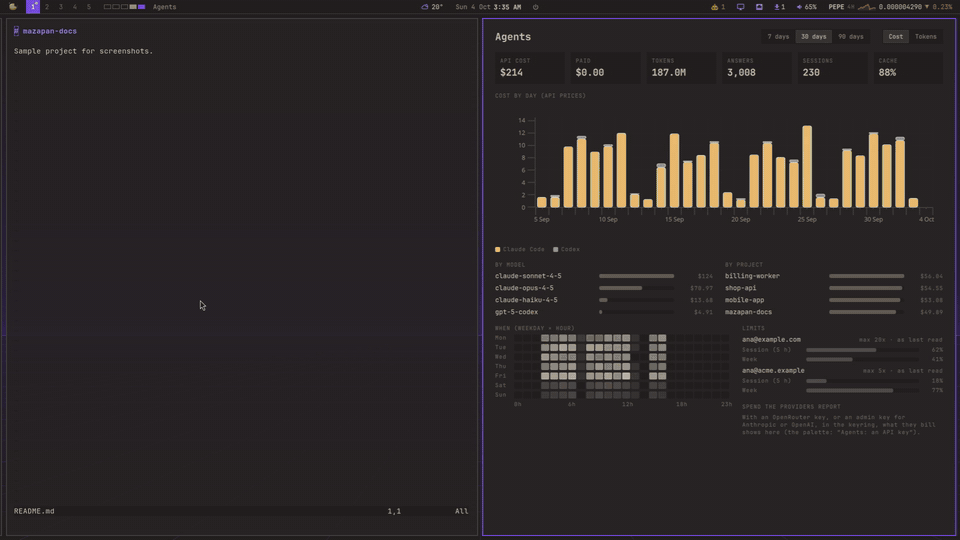</p>

<p align="center"><sub>Claude Code asks, through Mazapan's MCP server, to switch the theme. The card shows exactly what it would write; one click, and the whole desktop follows, the agents' dashboard included. <i>(Sample accounts and data.)</i></sub></p>

> **A personal project, shared as it is.** Mazapan is one person's desktop,
> made public in case it helps someone else. It comes with no warranty of
> any kind (see [LICENSE](LICENSE)): installing it erases the disk you pick,
> so back up what matters first, and read [docs/first-install.md](docs/first-install.md)
> and [docs/security.md](docs/security.md) before trying it on a real machine.

## Why I made Mazapan

I've been writing software for two decades, always on Windows. I still like
Windows, but Linux's versatility, and how far you can make it your own,
won me over.

So I changed Linux little by little until it became something I think is
worth sharing: a desktop for developers who want Linux without having to
live in the terminal to keep it running. Everything has a panel, and every
panel shows the command it runs, so you learn as you go instead of before
you start.

I'm a .NET developer, and I wanted to show that .NET belongs on Linux too:
the core of Mazapan is C#, compiled ahead of time into one native binary,
and ASP.NET Core, Aspire, Rider and VS Code are ready to use from the first
start.

I work with several coding agents and several subscriptions, and the tools
around them fell short: which one is waiting for me, how close each account
is to its limit, what all of it costs. So Mazapan grew around agents: it
sees them, counts for them, and lets them work on the system safely.

And we're all different: gamers, developers, designers, people who just
want a browser and an office suite. So the first start asks what you'll use
the computer for, and installs the apps for it, my .NET stack included.

If it's useful to you too, that's the best that could happen to it.

— rickdev

## Agentic OS

Most desktops treat a coding agent as one more terminal. Mazapan treats
agents as users of the system with their own place in it: it sees them, it
counts what they spend, it answers their questions about the machine, and
it lets them change things the way a person does, never behind your back.

<table>
  <tr>
    <td width="50%">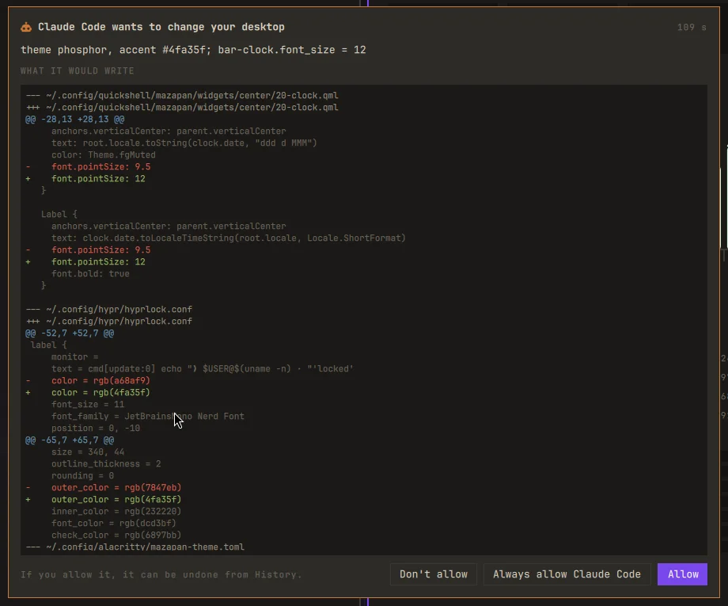<p align="center"><b>Every change approved</b>, with its exact diff</p></td>
    <td width="50%">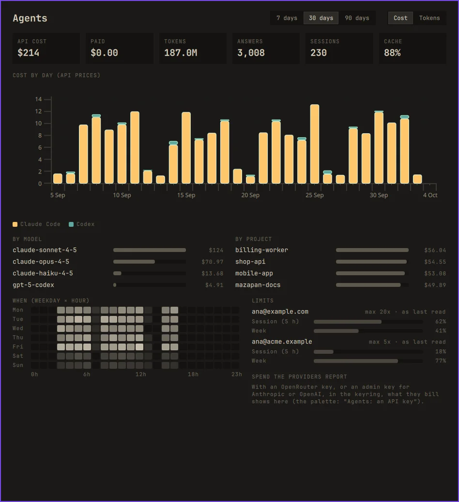<p align="center"><b>Dashboard</b>: cost, tokens, models, projects, limits</p></td>
  </tr>
  <tr>
    <td align="center">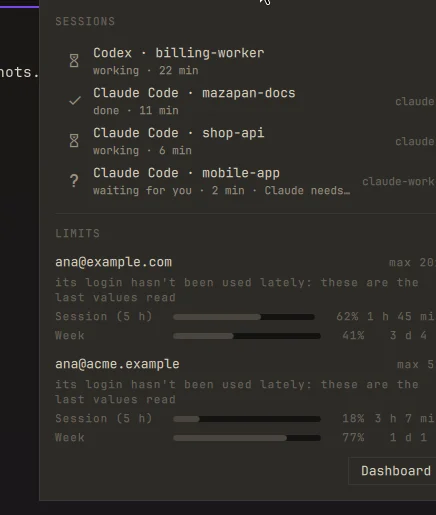<p align="center"><b>Live sessions</b> and each account's limits, in the bar</p></td>
    <td>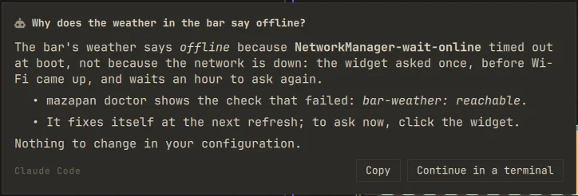<p align="center"><b>Ask</b> from anywhere, answered in a card</p></td>
  </tr>
</table>
<p align="center"><sub>Sample accounts and data; the answer shown is a sample too.</sub></p>

### Sees your agents
- **Live sessions in the bar** for Claude Code, Codex, opencode and pi: which
  one is working, which **waits for you** (with a notification), which is
  done; a click goes to its window.
- **Every account found by itself**, each Claude account's **limits** (the
  5-hour and weekly windows) and when they reset; `mazapan agents run claude`
  starts it with the first account that still has room.
- A **dashboard**: tokens and cost by day, agent, account, model and project,
  at API prices; what the providers actually billed (keys kept in the
  keyring); lines, commits and pull requests through OpenTelemetry; when you
  work, by weekday and hour. Numbers only, read locally: never a prompt.

### Lets them act, safely
- **A built-in MCP server**, `mazapan mcp`: agents read the whole state
  (themes, plugins, health checks, history, checkpoints, their own usage)
  and change the desktop through `preview_change`, `apply_change` and `undo`.
  ```sh
  claude mcp add --scope user mazapan -- mazapan mcp
  ```
- **The approval card**: an agent's change waits for you, showing who asks
  and the exact diff of every file. Allow, Don't allow, or Always allow
  that agent. Each change is marked with the agent in History, and undoable.
- **Guardrails by design**: agents set numbers and switches, never text
  that could become a command; nothing as root; no plugin installs or
  system updates. Those stay yours, and the agent is told the command to
  give you instead.

### Answers about your machine
- **Ask from anywhere**: `?` in the palette, about a screenshot, the
  selected text, files (right click in Files), or **by voice**. The answer
  comes in a card; "Continue in a terminal" picks the conversation up.
  Asked read-only, in an empty folder, with no keys.
- **Diagnosis built in**: an app crashes, a health check fails, or a
  checkpoint was needed, and "Ask an agent" hands over `mazapan report`
  (state, failing checks, recent errors, what changed since the
  checkpoint), framed as data, not instructions.
- **Recent projects** in the palette reopen the editor and the agent's last
  conversation together.

Full reference: [docs/agent-api.md](docs/agent-api.md).

## Made for developers, .NET first

- **The .NET profile**: the .NET SDK, ASP.NET Core's HTTPS development
  certificate trusted by .NET, Chromium and Firefox, **Aspire** and its
  templates, Rider and VS Code installed from their makers and checked
  against their SHA-256, dotnet's tools on the PATH, telemetry off.
- **Containers without root**: Podman with `docker` commands working, found
  by Testcontainers, devcontainers, Compose and Aspire.
- **Databases one click away**: PostgreSQL, SQL Server, MySQL, Redis and
  MongoDB in local containers, their data kept, the connection string
  copied in .NET's format or as a URL.
- **Mobile (Expo)**: Android's SDK and emulator, Java 17 for Gradle, phones
  over USB, a new Expo app one action away.
- **Profiles for everyone else**: Basic, Development, Gaming, Retro,
  Creative, Office, Streaming, Trading. Pick them at the first start or any
  time later (`SUPER + ALT + A`); each says what it will install, and is
  undoable.

## The desktop

<p align="center">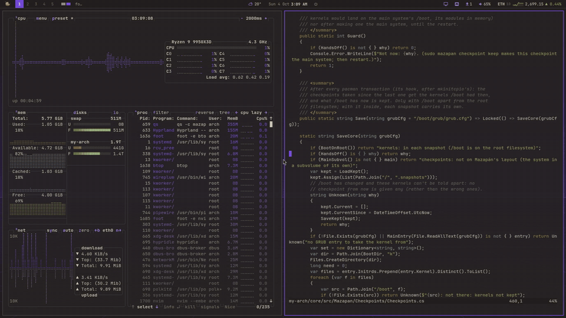</p>

<p align="center"><sub>One command changes everything: bar, terminals, editors, GTK and Qt apps, browsers, the lock and login screens, GRUB.</sub></p>

<p align="center">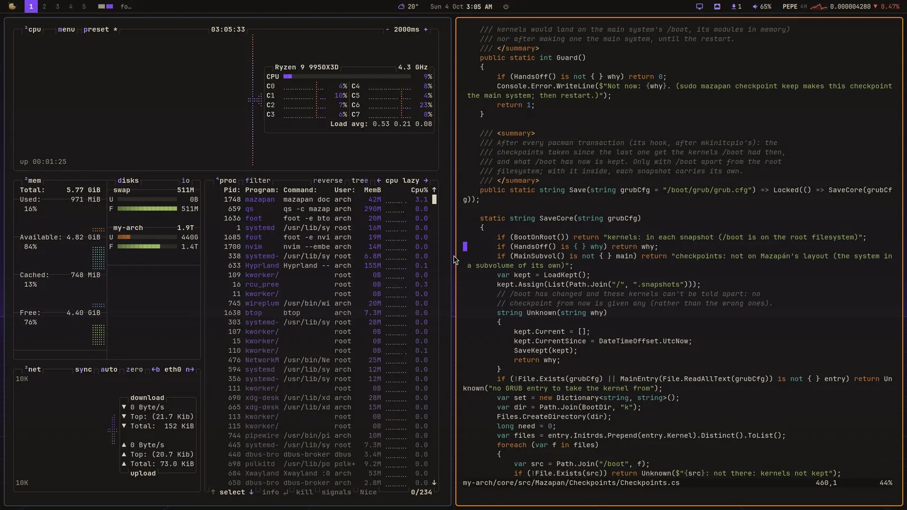</p>

## Features

Arch owns the critical parts (kernel, packages, updates); Mazapan is the
layer on top, written as 100 plugins over one small core, `mazapan`, a single
native binary. Every change it makes, yours or an agent's, is previewed,
written only where it may, and undoable.

### Install and security
- A **graphical installer** from a live desktop (and a text one for when
  graphics fail), in English, Spanish, Portuguese, French and German.
- **Full-disk encryption** by default (LUKS2, argon2id), one password for the
  disk, the account and the keyring, plus a **recovery key** shown once as
  text and QR.
- Firewall denying everything in, SSH only with keys, polkit asking every
  time; what's protected and what isn't is written down in
  [docs/security.md](docs/security.md).
- **Hardware fixes** chosen for the machine it runs on (27 `hw-*` plugins):
  NVIDIA (hybrid laptops included), AMD and Intel graphics, ASUS ROG, Framework,
  Surface, Apple, fingerprint readers, Wi-Fi quirks.

### Updates and checkpoints
- `mazapan update`: Arch news first, then each step with its ✓, then the
  health checks; **rolled back on its own** when a check fails.
- **Checkpoints**: a snapshot before every package change, listed in the
  boot menu. Boot into one, and if it works, keep it with one click; if it
  doesn't, "What broke?" hands the diagnosis to an agent.
- Your own signed repository for Mazapan, stable and edge channels,
  downloads ahead of time while plugged in.

### Desktop
- **Columns tiling** borrowed from Niri: a scrolling strip per workspace,
  widths that cycle, touchpad gestures, and an **overview** of every
  workspace (`SUPER + Tab`).
- A **command palette** (`SUPER + Space`) for apps, windows and every
  plugin's actions, each showing the command it runs.
- **Settings** (`SUPER + ,`), monitors with live thumbnails and profiles
  (`SUPER + SHIFT + M`), notifications with Do Not Disturb, an OSD, night
  light, idle and hibernate, modes (the whole desktop switched at once, by
  hand, schedule or screen).
- Capture (`Print`): region or window, copy, save, OCR, annotate, record.
- Clipboard history, emoji picker, color picker, offline dictation
  (whisper.cpp), reminders, Chinese/Japanese/Korean input, privacy dots.
- **History** of every change to the desktop, in words, each with its undo.

### Themes
- **One theme for the whole OS**: 16 theme targets, from Hyprland and the
  bar to Firefox, Chromium, VS Code, Neovim, Obsidian, GTK, Qt, Plymouth
  and GRUB.
- A picker (`SUPER + SHIFT + T`) that previews each theme live on your
  desktop; any accent color; **a whole theme from a picture**, with its
  contrast checked.

### Apps
- **Apps by what you'll do** (`SUPER + ALT + A`): Development, .NET, Mobile
  (Expo), Gaming, Retro, Creative, Office, Streaming… one button, said
  first, undoable.
- Web apps as apps of their own, default apps, Podman (or Docker) and
  one-click databases for development.

### Gaming and retro
- Steam, Heroic, Lutris, GameMode, MangoHud and gamescope, with the right
  Vulkan drivers for NVIDIA, AMD or Intel; tearing allowed and idle held
  while a game runs, games on the discrete GPU of a hybrid laptop.
- **Emulators** (RetroArch, DuckStation, PCSX2, Dolphin…), a ROMs folder per
  console, a game mode for the bar and notifications.
- Seven **screensavers** of Mazapan's own: Mazapan, CRT, rain, stars, life,
  pipes, glow.

### Sharing
- LocalSend to devices nearby, Taildrop to yours over Tailscale, from the
  palette or the file manager.

## Screenshots

<table>
  <tr>
    <td width="50%">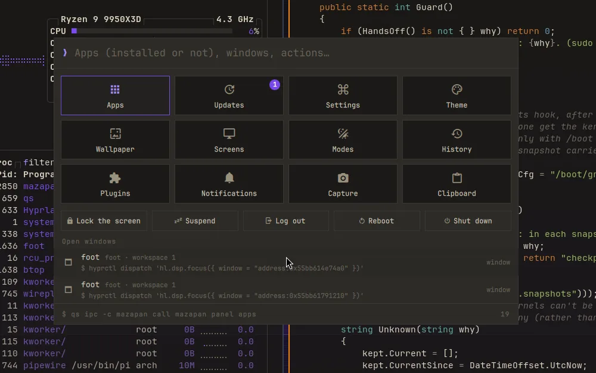<p align="center"><b>Command palette</b></p></td>
    <td width="50%">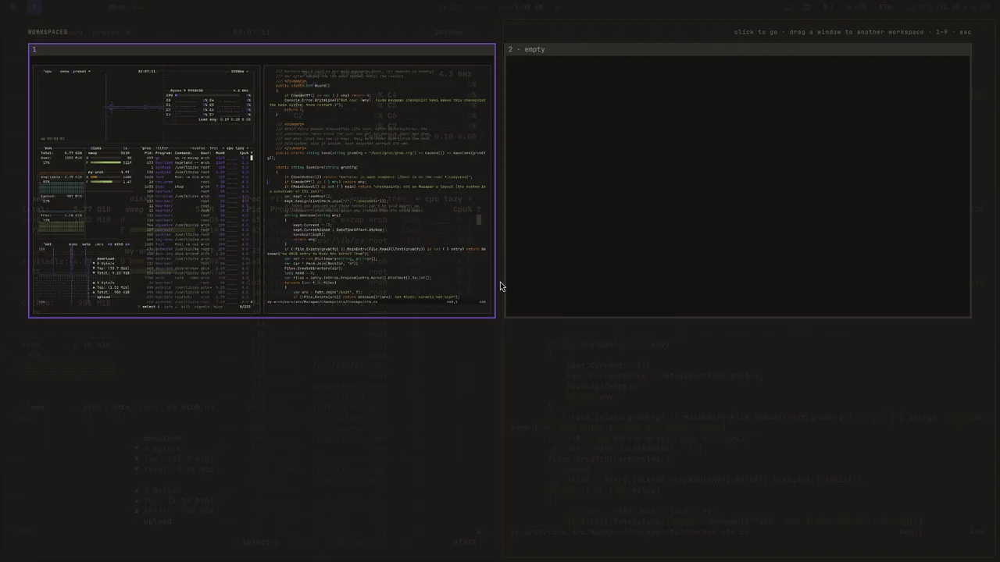<p align="center"><b>Overview</b> of every workspace</p></td>
  </tr>
  <tr>
    <td>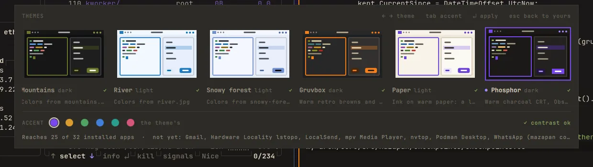<p align="center"><b>Theme picker</b>, previewed live</p></td>
    <td>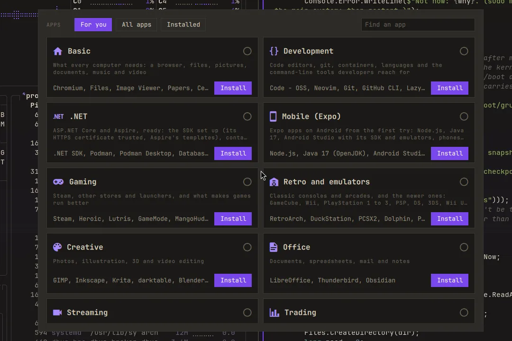<p align="center"><b>Apps</b> by what you'll do</p></td>
  </tr>
  <tr>
    <td>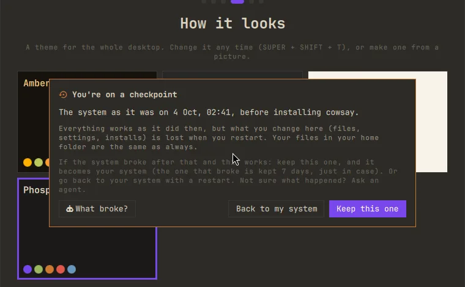<p align="center">Booted into a <b>checkpoint</b></p></td>
    <td>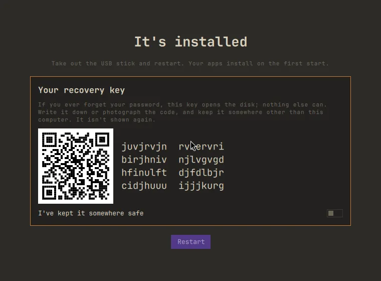<p align="center">The <b>installer</b>'s recovery key</p></td>
  </tr>
  <tr>
    <td>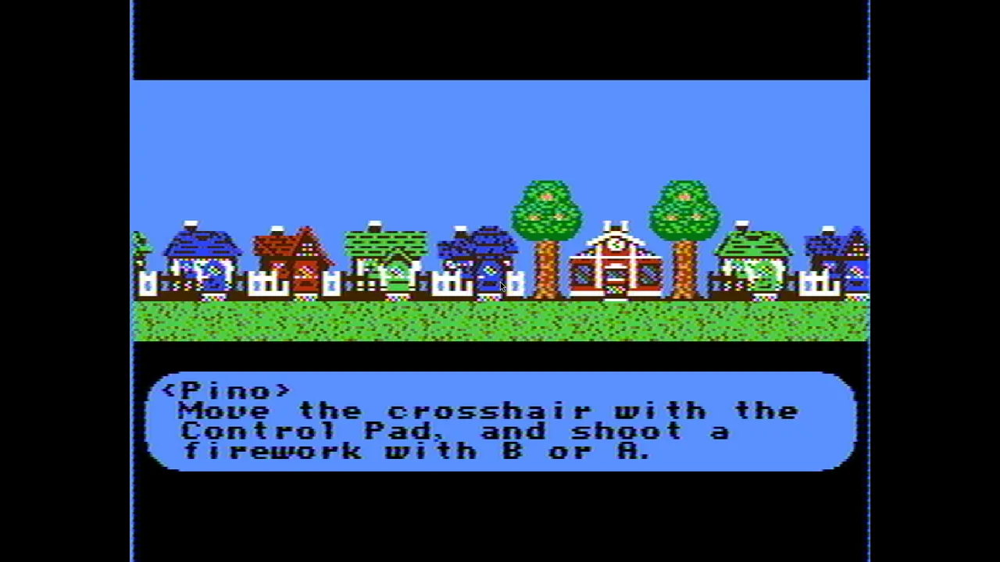<p align="center"><b>Retro</b>: a homebrew NES game in RetroArch</p></td>
    <td>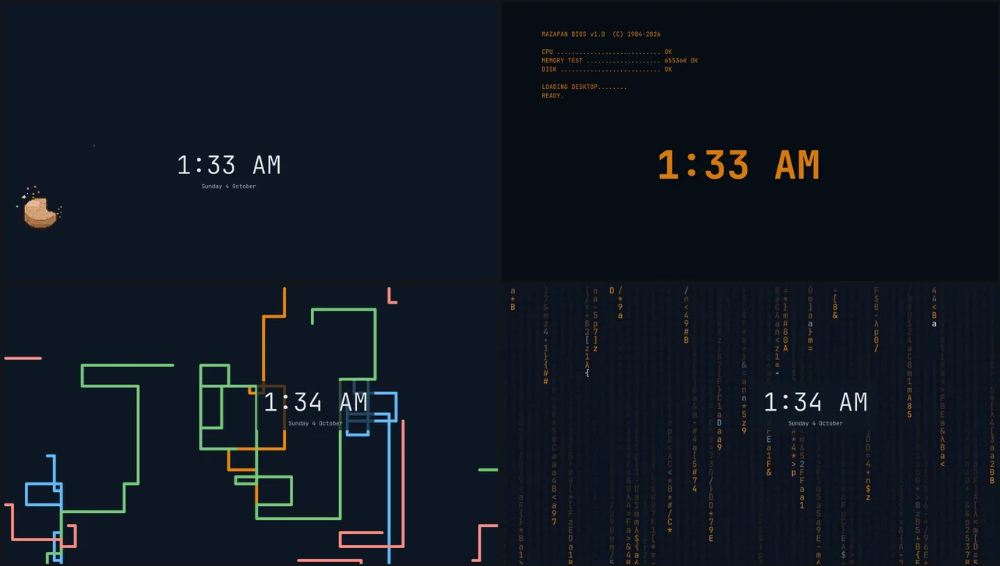<p align="center"><b>Screensavers</b>: Mazapan, CRT, pipes, rain</p></td>
  </tr>
  <tr>
    <td>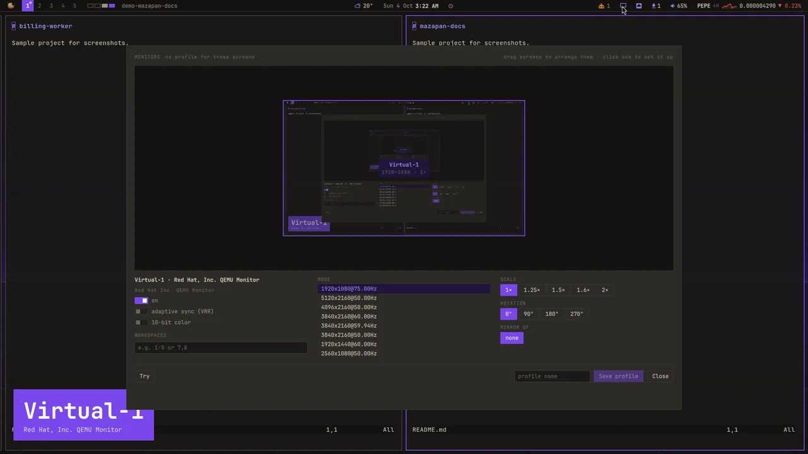<p align="center"><b>Monitors</b>, with live thumbnails and profiles</p></td>
    <td>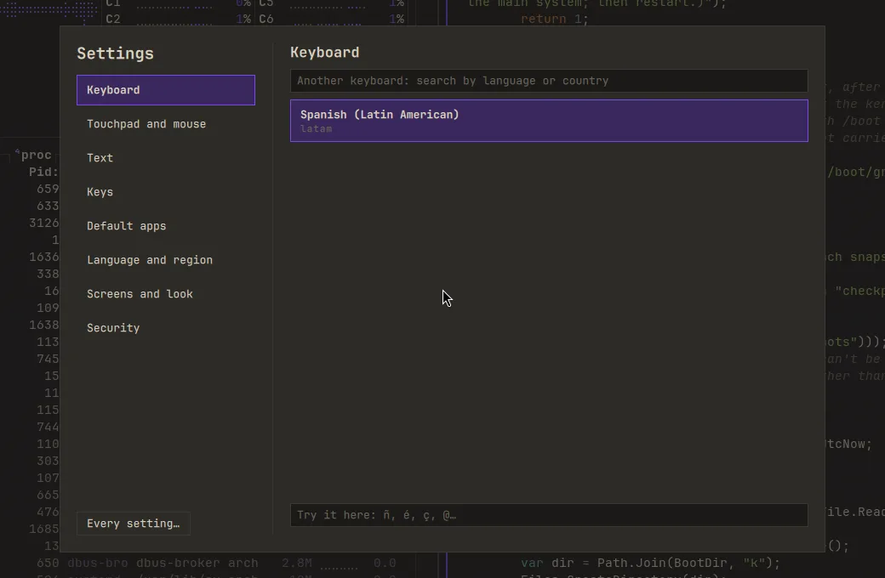<p align="center"><b>Settings</b></p></td>
  </tr>
</table>

## Install

There's no published ISO yet: build it from this repository in the dev VM
(`vm/vm iso`, see [docs/development.md](docs/development.md)), write it to
a USB stick, and boot it. Before a real machine, read
[docs/first-install.md](docs/first-install.md): Secure Boot off, graphics
on Hybrid, the recovery key written down.

Already on Arch with Hyprland? `mazapan` runs on its own too:

```sh
core/build test                  # needs the .NET 10 SDK and clang
mazapan apply --dry-run          # what it would write, nothing written
mazapan apply --theme phosphor   # write it; mazapan undo takes it back
```

## Documentation

| | |
|---|---|
| [docs/development.md](docs/development.md) | The `mazapan` command, the repository, the dev VM, each part of the desktop in detail |
| [docs/plugin-api.md](docs/plugin-api.md) | Writing a plugin: targets, templates, settings, health checks |
| [docs/agent-api.md](docs/agent-api.md) | Agents and MCP |
| [docs/first-install.md](docs/first-install.md) | The first install on real hardware |
| [docs/security.md](docs/security.md) | What's protected, and what isn't |
| [docs/roadmap.md](docs/roadmap.md) | Where it's going |

## License

[MIT](LICENSE). What Mazapan learned from others, and their notices, is in
[THIRD_PARTY_NOTICES.md](THIRD_PARTY_NOTICES.md); among them Omarchy, whose
hardware fixes the `hw-*` plugins carry. The name "Mazapan" and its icon
aren't covered by the license: a fork is welcome under another name.
